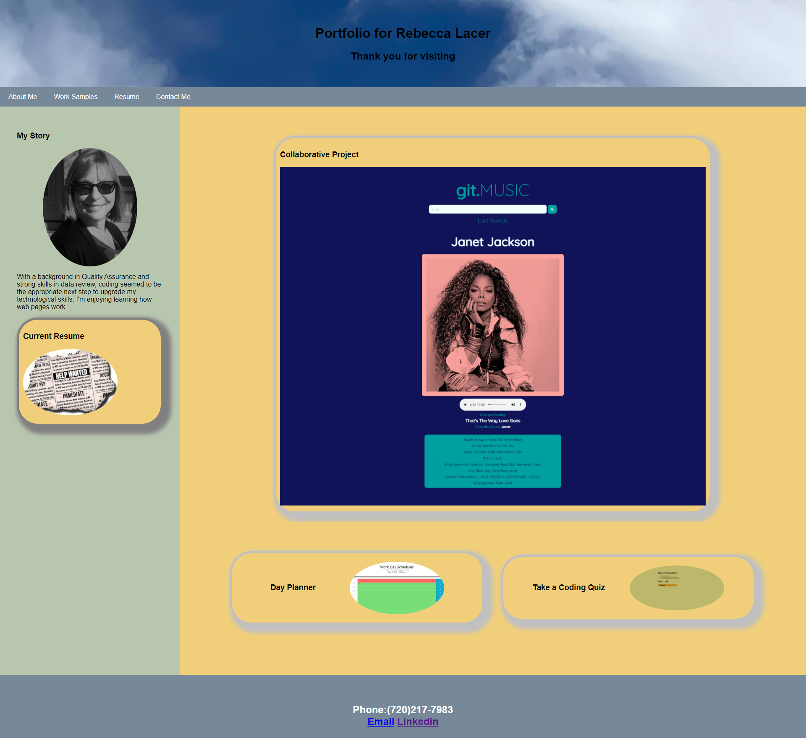

# Advanced-CSS-Portfolio

# Homework 2 

## Description of my work:

* When opening the page, my name, a recent photo and links to the different areas on the website are present.
* Clicking on the large image will take the visitor to my first homework page.
* The smaller images (work history & resume links) are placeholders for future work.
* The website is responsive to different screen sizes.

## Link to Website
https://rlacer.github.io/Digital-Portfolio/

## Screenshot
